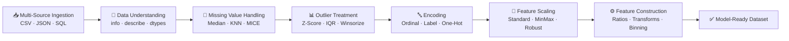

<div align="center">

# 🧑‍💻 Holistic Data Preparation
### Data Preprocessing & Feature Engineering Pipeline

*An end-to-end pipeline that turns raw, messy customer credit-risk data into model-ready features.*


</div>

---

## 📖 Table of Contents

- [Overview](#-overview)
- [Pipeline Architecture](#-pipeline-architecture)
- [Notebook Structure](#️-notebook-structure)
- [Tech Stack](#-tech-stack)
- [Installation](#-installation)
- [Usage](#-usage)
- [Dataset](#-dataset)
- [Key Outputs](#-key-outputs)
- [Project Structure](#-project-structure)
- [Roadmap](#-roadmap)
- [License](#-license)
- [Author](#-author)

---

## 🔍 Overview

This project demonstrates a **complete, production-style approach** to preparing tabular data for machine learning, using a synthetic **customer credit risk** dataset (age, income, credit score, loan amount, repayment history, employment type, and more).

It covers the full journey data takes before it ever reaches a model:

```
Raw Data → Cleaning → Missing Value Handling → Outlier Treatment →
Encoding → Scaling → Feature Construction → Model-Ready Dataset
```

---

## 🏗️ Pipeline Architecture



---

## 🗂️ Notebook Structure

| Part | Section | What Happens |
|:----:|---------|---------------|
| **B** | Data Import | Load data from CSV, JSON, and SQL (MySQL) |
| **C** | Data Understanding & Cleaning | `.info()`, `.describe()`, dtype & null checks |
| — | Missing Value Handling | Median / Most-Frequent imputation, Missing Indicators, Random Sample Imputation, **KNN Imputer**, **MICE**, Complete-Case Analysis |
| **D** | Outlier Handling | Z-Score, IQR, Percentile method, **Winsorization** |
| **E** | Feature Engineering | Datetime extraction, **Ordinal / Label / One-Hot Encoding**, Quantile & K-Means Binning |
| **F** | Feature Scaling | Standardization, Normalization, Min-Max, MaxAbs, Robust Scaling |
| **G** | Feature Construction & Transformation | Log / Reciprocal / Sqrt transforms, **Box-Cox & Yeo-Johnson**, `ColumnTransformer`, engineered ratio features |
| **H** | Final Deliverable | Consolidated preprocessing & feature engineering report |

---

## 🛠️ Tech Stack

<div align="center">

| Category | Tools |
|---|---|
| **Language** | Python 3 |
| **Data Handling** | pandas, numpy |
| **Visualization** | matplotlib, seaborn |
| **ML / Preprocessing** | scikit-learn (impute, preprocessing, compose, cluster) |
| **Statistics** | scipy |
| **Database** | mysql-connector-python |

</div>

---

## 📦 Installation

```bash
git clone <your-repo-url>
cd <your-repo-folder>
pip install -r requirements.txt
```

<details>
<summary>📄 requirements.txt (click to expand)</summary>

```
numpy
pandas
matplotlib
seaborn
scikit-learn
scipy
mysql-connector-python
jupyter
```
</details>

---

## ▶️ Usage

1. Update dataset paths and MySQL credentials in the notebook (see [Dataset](#-dataset) below).
2. Launch the notebook:
   ```bash
   jupyter notebook final_pr.ipynb
   ```
3. Run all cells top to bottom — each `Part` builds on the previous one.

---

## 📊 Dataset

| File / Source | Type | Purpose |
|---|---|---|
| `customer_credit_risk_dataset.csv` | CSV | Primary tabular dataset |
| `customer_metadata.json` | JSON | Supplementary customer metadata |
| `loan_repayment_history` (MySQL: `Holistic` DB) | SQL | Repayment history records |

> ⚠️ **Before running:** File paths and DB credentials are currently hardcoded to a local machine. Move them to environment variables:
> ```python
> import os
> DB_PASSWORD = os.getenv("DB_PASSWORD")
> ```

---

## 📈 Key Outputs

- ✅ Cleaned dataset — missing values & outliers resolved
- ✅ Encoded categorical features (ordinal, label, one-hot)
- ✅ Multiple scaled versions for comparison (Standard, MinMax, Robust, etc.)
- ✅ Normalized skewed distributions (log, Box-Cox, Yeo-Johnson)
- ✅ New engineered features:
  - `debt_to_income_ratio`
  - `average_monthly_transactions`
  - `spending_to_income_ratio`
  - `income_group` / `income_kmeans_group`
  - `high_credit_score`

---

## 📁 Project Structure

```
├── final_pr.ipynb          # Main notebook — full pipeline
├── Dataset/
│   ├── customer_credit_risk_dataset.csv
│   └── customer_metadata.json
├── requirements.txt
└── README.md
```

---

## 🗺️ Roadmap

- [ ] Move credentials/paths to `.env`
- [ ] Wrap pipeline into a reusable `sklearn.Pipeline`
- [ ] Add unit tests for transformation functions
- [ ] Add a model-training notebook downstream of this pipeline

---

## 📄 License

Licensed under the **MIT License** — feel free to use and adapt with attribution.

## 🙋 Author

**Mahesh Lohar**

<div align="center">

⭐ If this project helped you, consider giving it a star!

</div>
